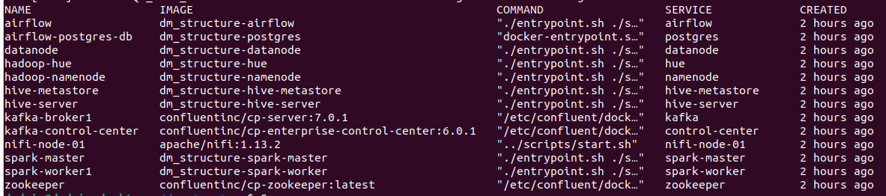

# Data Master Versão 3

Cluster para workload de estudos sobre tecnologias de big data usando containers docker.

## Containers parte desse trabalho

- Apache Hadoop:
    - Namenode
    - Datanode
- Apache Hive:
    - Hive-metastore
    - Hive-server

- Apache Spark
    - Master
    - Worker

- Apache Airflow
    - Airflow

- Apache Kafka
    - Kafka broker
    - Confluent Control Center
    - Kafka Connect

- Apache Nifi

- Serviços auxiliares
    - Postgres (database usado pelo airflow e pelo hive metastore);
    - Zookeeper (Serviço para sincronização de cluster usado pelo Kafka e pelo Nifi)

## Jornada inicial para conhecimento do Cluster

### 1- Pre-requisitos

- Ter docker instalado.
- Conexão com internet para fazer pull das imagens.
- Recomendado computador com mais de 16 GB de RAM.

### 2- Clone o repositório e execute script que faz build de imagens do cluster e sube containers

- $ git clone https://github.com/marcoaureliomenezes/dm_structure.git
- $ cd dm_structure
- $ ./start.sh

### 3- Overview em cluster Data Master Versão 3

Após execução do script start.sh os seguintes containers estarão de pé:

É possivel verificar com o comando `docker-compose ps`. Caso todos os container estejam em modo UP e saudáveis.

### 4- Interfaces com o usuário disponíveis para usuário

- Apache airflow: localhost:8080			
- Kafka Control Center: localhost:9021
- Apache Nifi  			localhost:6980/nifi/
- Cloudera Hue 			http://localhost:32762/hue/  

OBS: Verificar usuários definidos nas imagens

### 5- Verificação de serviços do Cluster

#### 5.1 Apache Hadoop

Teste de que ambiente Hadoop (HDFS):

- Entrar em container Namenode:	`$ docker-compose exec namenode /bin/bash`
- Veja diretório raiz do HDFS: `$ hdfs dfs -ls /`
- Crie arquivo local e diretório no lake: `$ echo "teste lake" > teste.txt && hdfs dfs -mkdir /sistemas`
- Faça um PUT no arquivo criado para o HDFS: `$ hdfs dfs -put teste.txt /sistemas/`
- Veja arquivo no HDFS pelo namenode: `$ hdfs dfs -cat /sistemas/teste.txt`
 
Validando ambiente distribuido HDFS:
 
- Acesse qualquer um dos seguintes containers:
    - `$ docker-compose exec datanode /bin/bash`
    - `$ docker-compose exec hive-server /bin/bash`
    - `$ docker-compose exec hive-metastore /bin/bash`
    - `$ docker-compose exec spark-master /bin/bash`
    - `$ docker-compose exec spark-worker /bin/bash`
    - `$ docker-compose exec airflow /bin/bash`
 		
- Todos esses containers fazem parte do HDFS. Logo o comando a seguir mostrará o arquivo criado e ingestado por um PUT pelo container namenode:
    - `$ hdfs dfs -cat /sistemas/teste.txt`
 	

#### 5.2 Apache Hive

Teste de ambiente Hive:

- Entrar em container do hive-server: `$ docker-compose exec hive-server /bin/bash`
- Veja os databases do HIVE: `$ hive -e "SHOW DATABASES;"`
- Crie um schema/database no HIVE: `$ hive -e "CREATE DATABASE teste;"`
- Veja database criado:	`$ hive -e "SHOW DATABASES teste;"`
 	
Validando ambiente Hive:
 
- Acesse qualquer um dos seguintes containers:
    - `$ docker-compose exec hive-metastore /bin/bash`
    - `$ docker-compose exec spark-master /bin/bash`
    - `$ docker-compose exec spark-worker /bin/bash`
    - `$ docker-compose exec airflow /bin/bash`
 		
- Todos esses containers fazem parte do hive. Logo os comandos a seguir mostrará o database criado a partir do container hive-server:
    - `$ hdfs dfs -cat /sistemas/teste.txt`
 		
 		
#### 5.3 Apache Spark
 
Testando ambiente Spark:

   		- `$ docker-compose exec spark-master /bin/bash`
 		- `$ docker-compose exec spark-worker /bin/bash`
 		- `$ docker-compose exec airflow /bin/bash`	
 		- `$ spark-submit`
 		
#### 5.4 Apache Airflow

Se vc consegue acessar o hive, o hadoop e o spark pelo container do airflow, vc consegue criar jobs que também acessem essas ferramentas.
 	